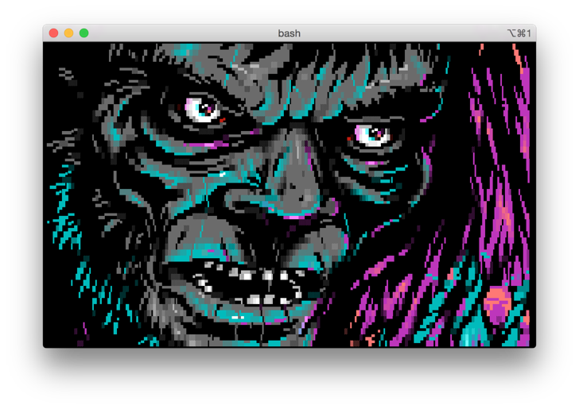

# Description

Ansilove-Term is a command line tool to display text-mode art files in an XTerm-256colors enabled terminal environment.

# Building

You may have to update your compiler in order to support `C++1Y` language features.

    make

# Usage

    ans [file ...]

ANSI, AnsiEdit, Artworx, ASCII, Binary, Ice Draw, PCBoard, Tundra, and XBin are supported. All color code sequences are matched with their nearest equivalent using the XTerm-256color palette, so results may vary for files that contain 24-bit color information. For best result, use [BlockZone][1] font.

# License

Ansilove is released under the BSD 3-Clause license. See `LICENSE.txt` file for details.

# Author

Ansilove-Term is developed by Andrew Herbert.

[1]: https://github.com/ansilove/BlockZone